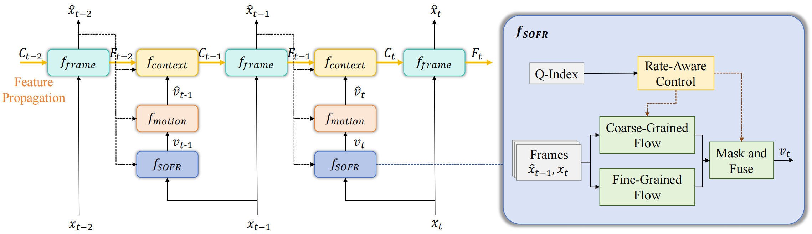
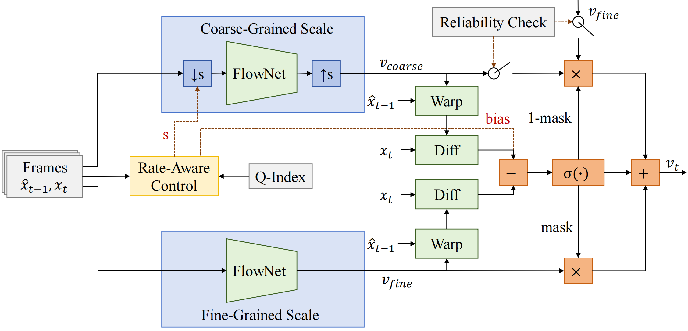
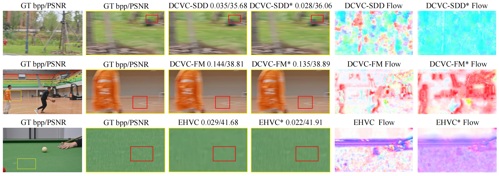

# SOFR

Official code for the ICME 2026 **Oral paper** *Boosting Neural Video Codec via Scale-Driven Online Flow Refinement*.

This repository provides a **training-free, plug-and-play** online flow refinement module that can be **directly** integrated into state-of-the-art Neural Video Codecs (NVCs) like [DCVC-SDD](https://github.com/xhsheng-ustc/DCVC-SDD), [DCVC-FM](https://github.com/microsoft/DCVC/tree/main/DCVC-family/DCVC-FM), and [EHVC](https://github.com/bytedance/NEVC), bridging the motion domain gap with negligible computational overhead.

## Introduction

State-of-the-art neural video codecs often suffer from limited generalization when encountering complex motion patterns unseen during training. SOFR addresses this without the expensive cost of online parameter fine-tuning.

* **Scale-Driven Dual-Granularity Flow Generation.** SOFR operates in parallel to generate both coarse-grained and fine-grained motion candidates. Coarse flows ensure robust structural stability, while fine flows preserve intricate local details.
* **Rate-Aware Fusion Strategy.** The module dynamically synthesizes the final refined flow field based on the quantization parameter (Q-Index). It selects different fusion strategies (down-sampling scales and decision biases) according to high/low bitrate modes, ensuring the preservation of fine details at high bitrates while prioritizing structural information at low bitrates.

The overall framework of the proposed method is illustrated below.

<div align="center">

</div>

As shown above, SOFR serves as a plug-and-play component within the temporal context propagation pipeline, rectifying motion vectors directly during inference. To dive deeper into the technical mechanics, the figure below details the internal architecture of the SOFR module, highlighting how the dual-granularity flow branches and the rate-aware control unit collaborate to produce the final refined motion field.

<div align="center">

</div>

## Results on USTC-TD Dataset

We evaluated SOFR on the comprehensive USTC-TD dataset. By functioning simply as an inference-time optimization strategy, SOFR consistently boosts compression efficiency across different SOTA baselines. 

**BD-Rate (%) Savings vs. Unoptimized Baselines** (negative is better):

<div align="center">
<table>
<thead>
<tr>
<th nowrap align="center">Baseline Model</th>
<th align="center">Optimization Metric</th>
<th align="center">Badminton</th>
<th align="center">BasketDrill</th>
<th align="center">BasketPass</th>
<th align="center">BicycleDriving</th>
<th align="center">Dancing</th>
<th align="center">FourPeople</th>
<th align="center">ParkWalking</th>
<th align="center">Running</th>
<th align="center">ShakeHands</th>
<th align="center">Snooker</th>
<th align="center"><strong>Avg BD-Rate</strong></th>
<th align="center">Coding Time</th>
</tr>
</thead>
<tbody>
<tr>
<td nowrap align="center" rowspan="2"><strong>DCVC-FM</strong></td>
<td align="center">PSNR</td>
<td align="center">-0.88</td>
<td align="center">-9.65</td>
<td align="center">-6.81</td>
<td align="center">-2.06</td>
<td align="center">0.18</td>
<td align="center">0.19</td>
<td align="center">-4.40</td>
<td align="center">0.04</td>
<td align="center">-2.68</td>
<td align="center">-2.34</td>
<td align="center"><strong>-2.84</strong></td>
<td align="center" rowspan="2">1.0240x</td>
</tr>
<tr>
<td align="center">MS-SSIM</td>
<td align="center">-0.56</td>
<td align="center">-13.31</td>
<td align="center">-8.53</td>
<td align="center">-3.07</td>
<td align="center">0.08</td>
<td align="center">-0.18</td>
<td align="center">-7.43</td>
<td align="center">0.24</td>
<td align="center">-4.37</td>
<td align="center">-3.34</td>
<td align="center"><strong>-4.05</strong></td>
</tr>
<tr>
<td nowrap align="center" rowspan="2"><strong>DCVC-SDD</strong></td>
<td align="center">PSNR</td>
<td align="center">0.14</td>
<td align="center">-0.87</td>
<td align="center">-0.27</td>
<td align="center">-6.61</td>
<td align="center">0.03</td>
<td align="center">-0.01</td>
<td align="center">-0.32</td>
<td align="center">0.09</td>
<td align="center">0.27</td>
<td align="center">-2.61</td>
<td align="center"><strong>-0.97</strong></td>
<td align="center" rowspan="2">1.0144x</td>
</tr>
<tr>
<td align="center">MS-SSIM</td>
<td align="center">0.01</td>
<td align="center">-0.81</td>
<td align="center">0.00</td>
<td align="center">-3.74</td>
<td align="center">0.01</td>
<td align="center">-0.03</td>
<td align="center">0.08</td>
<td align="center">-0.06</td>
<td align="center">0.33</td>
<td align="center">-0.15</td>
<td align="center"><strong>-0.44</strong></td>
</tr>
<tr>
<td nowrap align="center" rowspan="2"><strong>EHVC</strong></td>
<td align="center">PSNR</td>
<td align="center">0.22</td>
<td align="center">-3.78</td>
<td align="center">-1.78</td>
<td align="center">-3.59</td>
<td align="center">-0.06</td>
<td align="center">-0.04</td>
<td align="center">2.27</td>
<td align="center">0.01</td>
<td align="center">-0.26</td>
<td align="center">-2.11</td>
<td align="center"><strong>-0.91</strong></td>
<td align="center" rowspan="2">1.0181x</td>
</tr>
<tr>
<td align="center">MS-SSIM</td>
<td align="center">0.02</td>
<td align="center">-4.67</td>
<td align="center">-2.32</td>
<td align="center">-4.68</td>
<td align="center">0.05</td>
<td align="center">-0.03</td>
<td align="center">1.89</td>
<td align="center">-0.03</td>
<td align="center">-0.61</td>
<td align="center">-2.30</td>
<td align="center"><strong>-1.27</strong></td>
</tr>
</tbody>
</table>
</div>

### Visual Comparison

Our method effectively rectifies motion estimation errors in dynamic regions, yielding precise and coherent motion flows.

<div align="center">

</div>

## Usage

Before running the evaluation, please ensure that you have organized your test sequences as PNG files in RGB format using the BT.709 standard, as described in the test dataset guidelines of DCVC-FM.

Since SOFR is a plug-and-play module, you do not need to retrain the baselines. Please ensure you have set up the environment and downloaded the pretrained weights for the respective backbone ([DCVC-SDD](https://github.com/xhsheng-ustc/DCVC-SDD), [DCVC-FM](https://github.com/microsoft/DCVC/tree/main/DCVC-family/DCVC-FM), or [EHVC](https://github.com/bytedance/NEVC)).

This repository is organized into three folders corresponding to the supported baselines: `DCVC-SDD`, `DCVC-FM`, and `EHVC`. Inside each folder, you will find:
*   The modified flow estimation method (`video_model.py`) integrating our SOFR module.
*   Pre-computed `.json` files containing our encoding/decoding results for your reference.

To run the inference, you only need to copy our test script into the upstream baseline repositories to replace their default motion estimation calls.

**1. Copy the Code:** 
Choose your target framework and copy the `video_model.py` from our folder into the ./src/models directory of your local project.

**2. Run Inference:** 
Please ensure that you have successfully compiled the custom entropy model in the upstream repository to enable the actual encoding mode (generating real bitstreams). Then, use the commands below corresponding to your chosen framework. 

> **Note:** The Q-Index is automatically extracted during inference to trigger the Rate-Aware Control mechanism for optimal scale and bias selection.

### DCVC-FM
```text
python test_video.py --model_path_i ./checkpoints/cvpr2024_image.pth.tar --model_path_p ./checkpoints/cvpr2024_video.pth.tar --rate_num 4 --test_config ./dataset_config_example_rgb.json --cuda 1 --cuda_idx 0 1 2 3 --worker 4 --output_path ./output.json  --force_intra_period 9999 --force_frame_num 96 --write_stream 1 --stream_path ./bin --save_decoded_frame 1 --verbose 2
```
### DCVC-SDD
(Configured with Intra Period 32 as per the paper's settings)
```text
python ./test_all_video_psnr.py 
```

### EHVC
(Configured with Intra Period -1 as per the paper's settings)
```text
sh ./test_video_Fall_G-1.sh ./checkpoints/nevc1.0_intra.pth.tar ./checkpoints/nevc1.0_inter.pth.tar
```

## Future Directions

There are a few promising directions for future exploration:

*   **Complex Motion Datasets:** SOFR handles complex motions very well (for example, it shows excellent results on the `Jockey` sequence from the UVG dataset). Future work can focus on designing or testing on more datasets with fast and complex motion patterns.
*   **Finer Multi-Scale Fusion:** The way we mix coarse and fine optical flows can still be improved. Exploring more detailed, patch-based fusion strategies could make the motion estimation even more accurate.

  
## Citation
If you find this work useful for your research, please cite our arxiv paper.
